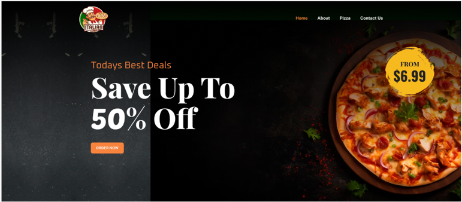
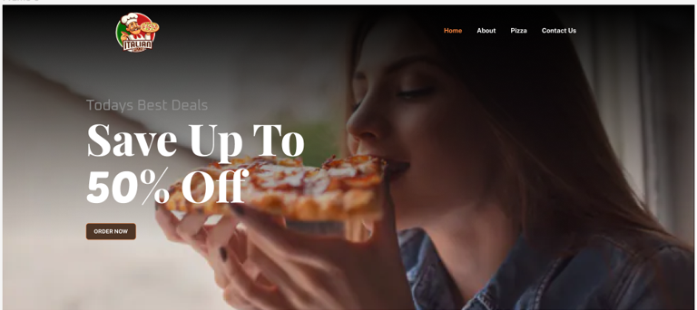
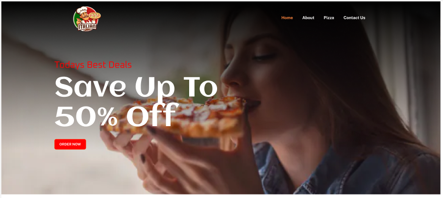
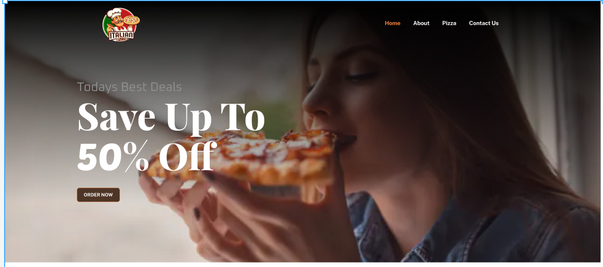
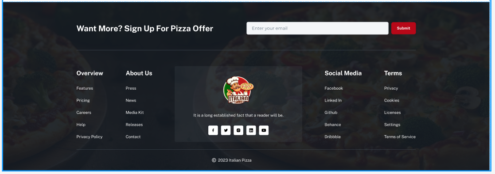
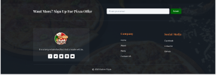

# UX Research Documentation: Iterative Design Testing

## Introduction
This document presents the findings and outcomes of the iterative design testing conducted for the home landing page. The testing process involved four iterations, each focusing on refining specific aspects of the design based on user feedback and usability metrics.

---

### Iteration 1: Version 1 to Version 2

**Design Overview:**
- **Date:** 11/25/2023
- **Tester:** Vivek Dhameliya

**Version 1:**
- Simple home landing page with a hero section.
- Hero text, background image, and "Order Now" button.
- Pizza-related black background in the hero section.

**Screenshot:**

**Feedback and Changes:**
 - Background Image: Replaced with an image featuring pizza and happy human faces.
 - Hero Text Color: Lightened to white for improved visibility and contrast.
 - Button Color: "Order Now" button color changed to brown for a warmer and more appetizing feel.

**Screenshot:**

**Testing Observations:**
- Testing Protocol
# A/B Testing:

Users interacted with both versions, recording metrics such as task completion time, errors, and satisfaction. A/B testing helped quantify the impact of design changes on user interaction and satisfaction.

# Think Out Loud:

Participants verbalized thoughts and feelings while navigating both versions. Valuable qualitative data was collected regarding user preferences and perceptions of the design changes.

# 5-Second Protocol:

Users were briefly exposed to each version for 5 seconds. Initial impressions and key elements noticed within this short timeframe were recorded.

## Testing Sessions

### Session 1 (Date: 11/27/2023):

Users interacted with Version 1. A/B testing identified areas for improvement, with users expressing a desire for a more visually appealing hero section. Version 2 implemented changes based on feedback, introducing a more vibrant and user-friendly hero section. Users interacted with the updated Version 2. A/B testing results showed improvements in user satisfaction and task completion. Think Out Loud sessions indicated positive feedback on the visual enhancements.

## Conclusion

The iterative design process significantly improved user satisfaction and engagement. Transitioning from Version 1 to Version 2 addressed user preferences, demonstrating the effectiveness of iterative testing.

# Iteration 2: Version 2 to Version 2.1

## Introduction
This iteration aimed to address user feedback regarding the absence of a testimonial section in the initial design, emphasizing likability and positive feedback.

## Design Overview

### Version 2.1:
- Addition of a testimonial section to the home landing page.
- Header with two texts: "Our Testimonials" and "What Customers Say About Us."
- Testimonial design includes user profile, name, positive feedback, and a 5-star rating.

## Testing Protocol
### A/B Testing:
- Users experienced both versions, with and without the testimonial section.
- Metrics such as user engagement, time spent on the page, and overall satisfaction were measured.

### Think Out Loud:
- Participants provided feedback on the newly added testimonial section.
- Insights were gathered on the effectiveness of the testimonials in conveying likability and building trust.

### 5-Second Protocol:
- Users were exposed to both versions for 5 seconds to capture initial impressions.
- Observations on the perceived trustworthiness and appeal of the design were recorded.

## Testing Sessions
### Session 3 (Date: 12/04/2023):
- Users interacted with Version 2.1, featuring the added testimonial section.
- A/B testing revealed increased user engagement and positive responses to the testimonials.
- Think Out Loud sessions indicated that users appreciated the testimonials for building trust and likability.
- Version 2.1 was refined based on Session 3 feedback, adjusting the layout and presentation of testimonials for optimal impact.
- Users experienced the refined Version 2.1.
- A/B testing results showed continued positive trends in user engagement and satisfaction.
- Think Out Loud sessions highlighted positive comments about the improved layout and user testimonials.

## Conclusion
The addition of a testimonial section significantly enhanced the perceived likability of the home landing page. The iterative process demonstrated responsiveness to user needs, contributing to a more engaging and user-friendly design.

[Version 1](design/usability_report/version_2.png)

[Version 2](design/usability_report/version_2.1.png)

# Iteration 3: Version 2.1 to Version 3.1

## Introduction
The third iteration focused on refining the color scheme in specific elements of the home landing page based on user feedback.

## Design Overview

### Version 3:
- Initial design with a light blue color in the footer.
- Hero section with "Today's Best Deals" text in red and a red "Order Now" button.

 

### Version 3.1:
- Changes made to address color concerns.
- Adjustments:
  - Hero Section: Changed the color of "Today's Best Deals" text from red to light grey.
  - Order Now Button: Updated the color from red to light yellow.

 

## Testing Protocol

### A/B Testing:
- Users interacted with both versions, comparing the original design (Version 3) with the updated design (Version 3.1).
- Metrics such as user engagement, color preferences, and overall satisfaction were measured.

### Think Out Loud:
- Participants shared their thoughts on the color changes in the hero section.
- Insights were gathered on the perceived visual appeal and user preferences regarding the updated color scheme.

### 5-Second Protocol:
- Users were exposed to both versions for 5 seconds to capture initial impressions.
- Observations on the impact of color changes on the hero section's visual appeal were recorded.

## Testing Sessions

### Session 5 (Date: 12/06/2023):
- Users interacted with Version 3, featuring the original color scheme.
- A/B testing results identified areas of concern regarding color harmony and user preferences.
- Version 3.1 was introduced with color adjustments in the hero section based on Session 5 feedback.
- Users experienced the refined Version 3.1.
- A/B testing revealed improved user engagement and positive responses to the updated color scheme.
- Think Out Loud sessions indicated user satisfaction with the enhanced visual appeal.

## Conclusion
The color adjustments in the third iteration successfully addressed user concerns and contributed to a more visually cohesive design. The transition from Version 3 to Version 3.1, informed by A/B testing, "Think Out Loud," and the "5-second protocol," demonstrated the importance of fine-tuning design elements based on user feedback.

# Iteration 4: Version 3.1 to Version 4.1

## Introduction
The fourth iteration centered on refining elements in both the top section and the footer of the home landing page based on user feedback.

## Design Overview

### Version 4:
- Initial design with a top section containing text, an email input, and a submit button in red.
- Footer with four columns: "Overview," "About Us," "Social Media," and "Terms," including a brand logo and social media links.

### Version 4.1:
- Changes made based on user feedback.
- Adjustments:
  - Top Section: Modified font style for the text "Want More? Sign Up For Pizza Offer" and changed the background color of the submit button to yellow.
  - Footer Section: Reorganized the layout, shifting the brand logo and social media links to the left. "About Us," "Social Media," and "Terms" links moved to the right. Changed font style and color to yellow for improved visibility and aesthetics.

## Testing Protocol

### A/B Testing:
- Users interacted with both versions, comparing the original design (Version 4) with the updated design (Version 4.1).
- Metrics such as user engagement, click-through rates, and overall satisfaction were measured.

### Think Out Loud:
- Participants shared their thoughts on the modifications in the top and footer sections.
- Insights were gathered on the perceived visual appeal and user preferences regarding the changes.

### 5-Second Protocol:
- Users were exposed to both versions for 5 seconds to capture initial impressions.
- Observations on the impact of font and color changes on user attention were recorded.

## Testing Sessions

### Session 7 (Date: 12/08/2023):
- Users interacted with Version 4, featuring the initial design.
- A/B testing results identified areas for improvement in user engagement and visual appeal.
- Version 4.1 was introduced with modifications based on Session 7 feedback.
- Users experienced the refined Version 4.1.
- A/B testing revealed improved user engagement, particularly in the top and footer sections.
- Think Out Loud sessions indicated positive feedback on the font and color changes, enhancing overall aesthetics.
# Iteration 5: Version 4.1 to Version 5.0

## Introduction
The fifth iteration aims to streamline the footer section of the home landing page based on user feedback, focusing on reducing the number of links to enhance usability and meet specific website requirements.

 

### Version 4.1:
- The footer includes four columns with links: "Overview," "About Us," "Social Media," and "Terms."
- Brand logo and social media links are present.

### Suggested Changes for Version 5.0:
- Simplification of the footer by reducing the number of links.
- Retaining essential links aligned with website requirements.
- Maintaining a cohesive and visually appealing layout.

 

## Testing Protocol

### A/B Testing:
- Users will interact with both versions (Version 4.1 and Version 5.0).
- Metrics such as click-through rates, user engagement, and overall satisfaction will be measured for the footer section.

### Think Out Loud:
- Participants will provide feedback on the revised footer, focusing on the usability of the reduced links.
- Insights will be gathered into user preferences and satisfaction with the simplified layout.

### 5-Second Protocol:
- Users will be exposed to both versions (Version 4.1 and Version 5.0) for 5 seconds.
- Observations on the initial impressions and key elements noticed in the footer section will be recorded.

## Testing Session

### Session 9 (Date: 12/12/2023):
- Users will interact with both versions to compare the existing design (Version 4.1) with the revised Version 5.0.
- A/B testing results will be analyzed to identify improvements in click-through rates and user engagement related to the footer section.

## Conclusion
The fourth iteration successfully addressed user feedback by refining the font, color scheme, and layout in both the top and footer sections. The transition from Version 4 to Version 4.1, informed by A/B testing, "Think Out Loud," and the "5-second protocol," demonstrated the significance of fine-tuning design elements based on user preferences. The iterative testing process continues to play a crucial role in optimizing the home landing page for improved visual appeal and user satisfaction.
